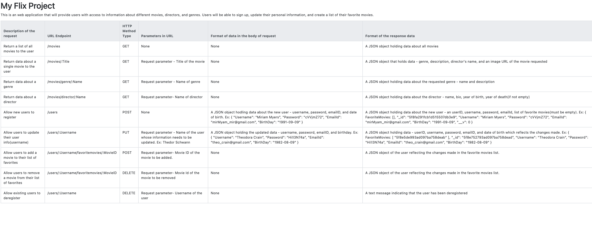

# MOVIE FLIX

This is the server-side of the movies application. The app provides information about movies - the synposis, director and his details, genre and its details. It also lets a user sign up for an account and allows the user to update movies to their favorite list.

## Details

- Built using Node.js and Express.
- The API structure follows the RESTFUL architectural pattern.
- Uses MongoDb for the database creation.
- The business logic is modeled using Mongoose.
- Uses middleware modules like bodyParser and Morgan.
- Deployed to Heroku.

## URL Endpoints

The image below shows the URL for each API, the parameters it takes, how the request body should like, and the format of the response received.

